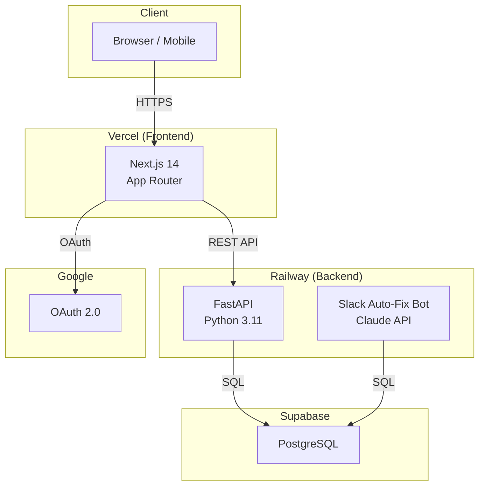
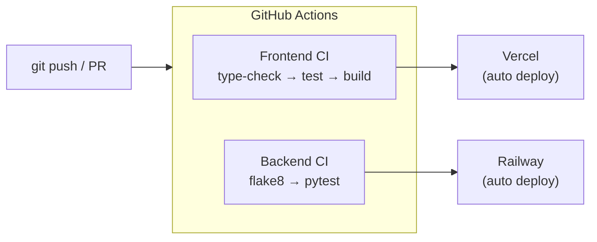
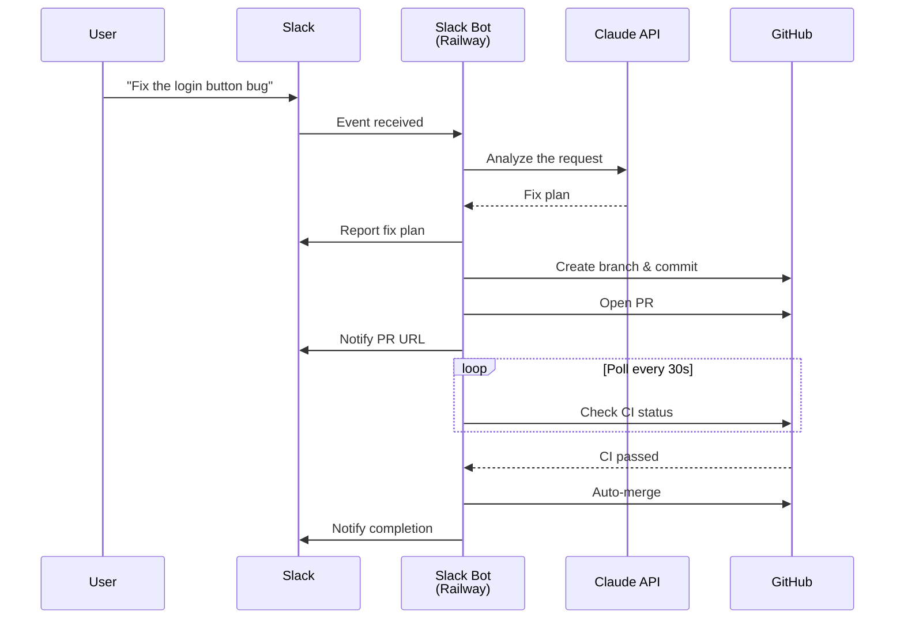

# habit-tracker

[](https://github.com/Ryosuke-Ha/habit-tracker/actions/workflows/backend-ci.yml)
[](https://github.com/Ryosuke-Ha/habit-tracker/actions/workflows/frontend-ci.yml)
[](https://habit-tracker-two-peach.vercel.app)

A habit management web app based on the philosophy of Atomic Habits.

**Demo:** https://habit-tracker-two-peach.vercel.app

---

## Screenshots

> Screenshots coming soon

---

## Features

- **Daily habit TODO management** — Template system with day-of-week settings (weekday/weekend)
- **Persistent TODOs** — Tasks that remain visible every day until completed
- **Subtask support** — Break down each TODO into subtasks with progress tracking
- **Weekly review (KPT)** — Structured weekly reflection using Keep / Problem / Try format
- **Monthly review** — Achievement rate graphs and monthly goal setting
- **Google authentication** — Sign in with your Google account
- **Cross-device settings sync** — Sync habit templates between PC and mobile

---

## Tech Stack

### Frontend
| Technology | Version |
|------------|---------|
| Next.js (TypeScript, App Router) | 14.2.3 |
| Tailwind CSS | 3.3.0 |
| NextAuth.js | 4.24.13 |
| Recharts | 3.8.0 |

### Backend
| Technology | Version |
|------------|---------|
| FastAPI | 0.111.0 |
| SQLAlchemy + Alembic | 2.0.30 / 1.13.1 |
| PostgreSQL (Supabase) | — |

### Infrastructure
| Purpose | Service |
|---------|---------|
| Frontend | Vercel |
| Backend + Slack Bot | Railway |
| Database | Supabase (PostgreSQL) |
| CI/CD | GitHub Actions |

### AI
| Purpose | Service |
|---------|---------|
| Slack Auto-Fix Bot | Anthropic Claude API |

---

## Architecture Diagram

### Infrastructure



### CI/CD Flow



### Slack Auto-Fix Bot Flow



---

## Getting Started

### Prerequisites

- Node.js 20+
- Python 3.11+
- Git

### Setup

#### 1. Clone the repository

```bash
git clone https://github.com/Ryosuke-Ha/habit-tracker.git
cd habit-tracker
```

#### 2. Frontend setup

```bash
cd frontend
npm install
cp .env.example .env.local
# Edit .env.local with your environment variables (see Environment Variables below)
```

#### 3. Backend setup

```bash
cd ../backend
python -m venv venv
source venv/bin/activate  # Windows: venv\Scripts\activate
pip install -r requirements.txt
cp .env.example .env
# Edit .env with your environment variables (see Environment Variables below)
```

#### 4. Run DB migration

```bash
alembic upgrade head
```

#### 5. Start the app

Open two terminals and run:

```bash
# Backend (in the backend/ directory)
uvicorn main:app --reload --port 8000

# Frontend (in the frontend/ directory)
npm run dev
```

Open http://localhost:3000 in your browser.

---

## Environment Variables

### Frontend (`frontend/.env.local`)

| Variable | Description |
|----------|-------------|
| `GOOGLE_CLIENT_ID` | OAuth 2.0 Client ID from Google Cloud Console |
| `GOOGLE_CLIENT_SECRET` | OAuth 2.0 Client Secret from Google Cloud Console |
| `NEXTAUTH_SECRET` | Secret key for NextAuth (generate with `openssl rand -base64 32`) |
| `NEXTAUTH_URL` | App URL (development: `http://localhost:3000`) |
| `NEXT_PUBLIC_BACKEND_URL` | FastAPI URL (development: `http://localhost:8000`) |

### Backend (`backend/.env`)

| Variable | Description |
|----------|-------------|
| `DATABASE_URL` | DB connection URI (development: `sqlite:///./habit_tracker.db`, production: Supabase Transaction pooler URI) |
| `FRONTEND_URL` | Frontend URL for CORS (e.g. `http://localhost:3000`) |

### Slack Bot (`slack-bot/.env`)

| Variable | Description |
|----------|-------------|
| `SLACK_BOT_TOKEN` | Bot Token starting with `xoxb-` |
| `SLACK_APP_TOKEN` | App-Level Token starting with `xapp-` (for Socket Mode) |
| `SLACK_CHANNEL_ID` | Target channel ID (e.g. `#habit-tracker-bot`) |
| `ANTHROPIC_API_KEY` | Anthropic API Key |
| `GITHUB_TOKEN` | GitHub Personal Access Token (requires `repo` scope) |
| `GITHUB_REPO` | Target repository (e.g. `Ryosuke-Ha/habit-tracker`) |

---

## Slack Auto-Fix Bot

An AI-powered bot that receives natural language instructions in Slack, modifies the codebase via GitHub, and automatically opens and merges PRs.

### Setup

1. Create a Slack app at [api.slack.com/apps](https://api.slack.com/apps) and enable Socket Mode
2. Add Bot Token Scopes: `chat:write`, `channels:read`, `files:write`
3. Fill in `slack-bot/.env` with your tokens
4. Deploy to Railway, or run locally:

```bash
cd slack-bot
python -m venv venv
source venv/bin/activate
pip install -r requirements.txt
cp .env.example .env
# Edit .env
python main.py
```

### Usage

Mention the bot in `#habit-tracker-bot` with your instruction:

```
@habit-tracker-bot Change the chart color on the monthly review page to blue
@habit-tracker-bot Add a description to the login screen
@habit-tracker-bot Add created_at to the backend API response
```

The bot will automatically:

1. Investigate related files and report the fix plan to Slack
2. Create a feature branch and commit the changes
3. Open a Pull Request and notify Slack with the PR URL
4. Poll GitHub Actions CI every 30 seconds until it passes
5. Auto-merge the PR and notify completion

---

## GitHub Actions Secrets

The following repository secrets are required for GitHub Actions workflows to work correctly.

Go to **Settings → Secrets and variables → Actions → New repository secret** and add each one.

| Secret | Required by | Description |
|--------|-------------|-------------|
| `ANTHROPIC_API_KEY` | `docs-update.yml` | Anthropic API key used by the auto-documentation workflow to call Claude |
| `BACKEND_URL` | `notification-check.yml` | Backend URL (e.g. `https://your-app.railway.app`) |
| `INTERNAL_API_KEY` | `notification-check.yml` | Secret key shared between GitHub Actions and backend for internal endpoints |

> **Note:** `GITHUB_TOKEN` is provided automatically by GitHub Actions and does not need to be added manually.

The other secrets used in production (Google OAuth, Supabase, Slack tokens, etc.) are set directly in the **Vercel** and **Railway** dashboards — they do not need to be added as GitHub repository secrets.

---

## Slack通知チャンネルのセットアップ

TODOメモのSlack通知機能を使うには、以下の手順でチャンネルを設定してください。

1. Slackで `#habit-tracker-notify` チャンネルを作成する
2. Botをチャンネルに招待する:
   ```
   /invite @habit-tracker-bot
   ```
3. チャンネルIDを取得する（チャンネル名を右クリック → リンクをコピー → URLの末尾部分 `C0XXXXXXXXX`）
4. 以下の環境変数を設定する:

   **backend/.env**
   ```
   SLACK_BOT_TOKEN=xoxb-...        # slack-bot/.env と同じ値
   SLACK_NOTIFY_CHANNEL=C0XXXXXXXXX
   INTERNAL_API_KEY=your-secret-key
   ```

   **Railway Variables（本番環境）**
   - `SLACK_BOT_TOKEN`
   - `SLACK_NOTIFY_CHANNEL`
   - `INTERNAL_API_KEY`

5. GitHub Actions Secrets に以下を追加する:
   - `BACKEND_URL`: バックエンドのURL（例: `https://your-app.railway.app`）
   - `INTERNAL_API_KEY`: 上記と同じ値

---

## License

[MIT License](LICENSE)
