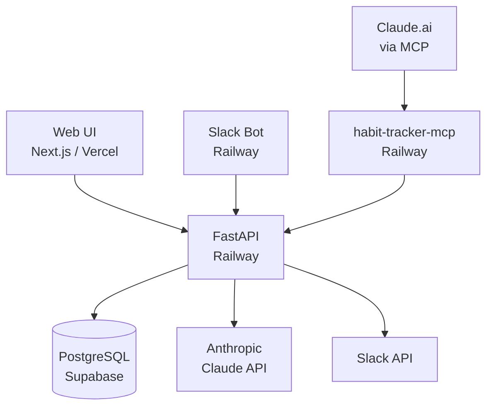
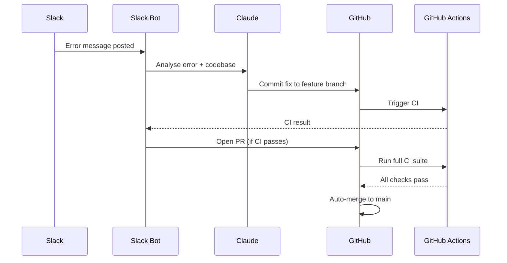

# habit-tracker

A personal habit management web app based on Atomic Habits principles.
Features AI coaching, weekly/monthly retrospectives, Slack notifications, and MCP integration.

Built to demonstrate production-grade architecture with DDD, multi-agent CI, and Claude API integration
across Web, Slack, and MCP surfaces — all sharing a single FastAPI backend.

---

## Features

### Habit Management
- Daily habit TODO management with day-of-week templates
- Subtask management (inline editing, drag & drop reordering)
- Persistent TODOs (displayed daily until completed)
- Scheduled memos (date-specific tasks with Slack notifications)

### Retrospectives
- Weekly retrospective (KPT format, AI analysis, last week's Try display)
- Monthly retrospective (achievement rate chart, AI analysis, reflective questions)

### AI Coaching
- Cognitive science-based coaching (3-turn structure, insight-driven questions)
- Previous session commitments carried over to next week
- Automatic transition to coaching after weekly retrospective

### Notifications & Integrations
- Slack notifications (scheduled memo reminders via GitHub Actions)
- Slack Auto-Fix Bot (Claude-powered: reads error → commits fix → opens PR → monitors CI → auto-merges)
- MCP integration (operate TODOs and check retrospectives from Claude.ai)

---

## Tech Stack

| Category | Technology |
|---|---|
| Frontend | Next.js 14<br/>App Router, TypeScript, Tailwind CSS |
| Mobile | React Native (Expo SDK 54) |
| Backend | FastAPI (Python 3.11)<br/>SQLAlchemy, Alembic |
| Database | PostgreSQL (Supabase) |
| Auth | NextAuth.js (Google OAuth) |
| Infrastructure | Vercel (Frontend) · Railway (Backend + Slack Bot) |
| AI | Anthropic Claude API |
| Notifications | Slack Bot (GitHub Actions trigger) |
| MCP | habit-tracker-mcp (separate repository) |

---

## Domain Model

### Why Three TODO Types?

TODO is split into three distinct models rather than a single model with a `type` field:

| Model | Lifetime | Key Behaviour |
|---|---|---|
| `DailyLog` | One day | Generated from Template on first access; checked off daily |
| `PersistentTodo` | Until completed | Surfaces every day regardless of date; no expiry |
| `ScheduledMemo` | Specific date | Date + optional time; triggers Slack notification |

Collapsing these into one model would force every query to carry date/template/notification
logic that only applies to a subset of rows.
The boundary makes invariants explicit: a `DailyLog` always belongs to a template;
a `ScheduledMemo` always has a target date.

### Template → Log Boundary

`Template` is the *definition* (which habits, what schedule).
`DailyLog` is the *record* (did it happen on a given day).

Logs are generated lazily on first access for the day, not by a background batch job.
This avoids stale rows for days the user never opens the app,
and keeps the generation logic co-located with the read path.

### Coaching Session Aggregate

`CoachingSession` owns its `CoachingMessage` children.
Messages cannot be added to a completed session (enforced in the domain model, not the router).
The 3-turn structure (check-in → deepen → commit) is encoded in the system prompt,
and the final user message is stored as `commit_content` and surfaced at the start of the next week's session.
"This week" is derived from JST wall-clock time, not UTC, to match the user's mental model.

### Subtask Progress Calculation

Subtask completion rate is calculated in the **API layer** (`GET /logs/today` response),
not in the frontend and not in a DB view.
This keeps the computation close to the data and leaves the frontend as a pure renderer.

---

## Where Business Rules Live

| Rule | Location | Reason |
|---|---|---|
| TODO type invariants | Domain model (`models.py`) | Prevents invalid state at the object level |
| Coaching session state machine | `CoachingSession.complete()` | Rejects double-completion before hitting the DB |
| Weekly period calculation | `WeekPeriod` value object | Single source of truth; eliminates scattered date math |
| Achievement rate | API layer (`WeeklyAchievementService`) | Shared by Web, Slack Bot, and MCP without duplication |
| Subtask progress | API response (serialiser) | Frontend receives ready-to-render data |
| Prompt injection sanitisation | `utils/sanitize.py` | Centralised; applied before any user text reaches Claude |
| Notification timing | `calc_notification_datetime()` | Offset logic isolated from the scheduler |

---

## Design Decisions

### 1. Single API consumed by Web, Slack, and MCP

All three surfaces call the same FastAPI endpoints with the same auth header (`X-API-Key`).
The Web UI, the Slack DataOperator Bot, and the MCP server are treated as equal clients.

*Why:* Avoids logic drift between surfaces. A rule added to the API is immediately available
everywhere. This is the core principle from Nakajimasou's AI-Native architecture:
business logic lives in the API, not in the client.

### 2. MCP in a separate repository

`habit-tracker-mcp` is a standalone TypeScript project deployed independently on Railway.

*Why:* The MCP server's release cycle is decoupled from the main app.
Breaking changes to the MCP protocol don't require a full backend redeploy.
It also makes the boundary explicit: the MCP server is a client, not part of the backend.

### 3. Claude Sonnet for coaching, Haiku for analysis

| Feature | Model | Reason |
|---|---|---|
| AI Coaching | claude-sonnet-4-6 | Multi-turn dialogue; nuanced follow-up questions matter |
| Weekly / Monthly Analysis | claude-haiku-4-5 | Single-pass summarisation; cost > quality tradeoff |

Opus was used initially for coaching but replaced with Sonnet after cost analysis showed
~80% reduction with no measurable quality drop for structured 3-turn sessions.

### 4. Prompt injection defence via sanitisation, not XML escaping alone

User-supplied text (KPT items, coaching replies) is passed through `sanitize_for_prompt()`
before being embedded in any Claude message.
The function strips known injection patterns (`ignore previous instructions`, `system:`, etc.)
and enforces per-field length limits (KPT: 300 chars, coaching: 1000 chars).

*Why not XML escaping only:* XML escaping prevents tag injection but does not remove
natural-language override attempts. Both layers are needed.

### 5. PR auto-creation, manual merge

`auto-pr.yml` opens a PR automatically on every feature push.
Merging to `main` requires a manual step.

*Why:* Fully automated merge to production removes the human checkpoint.
For a solo developer, the PR is the review gate — AI Code Review runs on it,
CI must pass, and the developer reads the diff before merging.
Automation handles the mechanical work; judgement stays with the human.

### 6. Lazy log generation, not batch

Daily logs are created on first page load for the day, not by a scheduled job.

*Why:* A cron job would create logs for every day regardless of whether the user opens the app,
generating noise in the achievement rate denominator.
Lazy generation means the denominator only includes days the user actually engaged.

### 7. JST-first date handling throughout

All date calculations — weekly periods, notification offsets, MCP tool calls — use JST (`Asia/Tokyo`),
not UTC.

*Why:* Railway servers run on UTC. A habit scheduled for "Monday morning" should fire on
Monday JST, not Sunday UTC. Getting this wrong causes notifications to arrive a day early
for users in UTC+9 between midnight and 09:00.

---

## Current Design Limitations

**Single-user assumption**
`DailyLog` has no `user_id` column; user isolation relies on the template relationship.
A multi-user deployment would require a migration and query rewrites.
Tracked in [#13](https://github.com/Ryosuke-Ha/habit-tracker/issues/13).

**Achievement rate at scale**
The weekly achievement rate is calculated by loading all `DailyLog` rows for the week into memory.
For a single user this is fine (~50–100 rows). For many users it would need a materialised view or
incremental aggregation.

**Claude API dependency**
There is no fallback if the Anthropic API is unavailable.
Coaching and analysis endpoints return 500 during an outage.
A circuit-breaker or cached-last-result strategy would improve resilience.

**Streak calculation**
Streak is computed on every monthly stats request by iterating over daily logs.
This is O(n) in the number of days and acceptable for personal use,
but would not scale to a large dataset without a dedicated `streak` column updated incrementally.

---

## Architecture


```mermaid
graph TD
    A[Web UI<br/>Next.js / Vercel] --> D[FastAPI<br/>Railway]
    B[Slack Bot<br/>Railway] --> D
    C[Claude.ai<br/>via MCP] --> E[habit-tracker-mcp<br/>Railway]
    E --> D
    D --> F[(PostgreSQL<br/>Supabase)]
    D --> G[Anthropic<br/>Claude API]
    D --> H[Slack API]
```

### Slack Auto-Fix Bot Sequence


```mermaid
sequenceDiagram
    participant S as Slack
    participant B as Slack Bot
    participant C as Claude
    participant G as GitHub
    participant CI as GitHub Actions

    S->>B: Error message posted
    B->>C: Analyse error + codebase
    C->>G: Commit fix to feature branch
    G->>CI: Trigger CI
    CI-->>B: CI result
    B->>G: Open PR (if CI passes)
    G->>CI: Run full CI suite
    CI-->>G: All checks pass
    G->>G: Auto-merge to main
```

---

## Getting Started

See [docs/SETUP.md](docs/SETUP.md) for full environment variable reference,
Slack Bot setup, and GitHub Actions secrets configuration.

### Quick Start

#### Backend
```bash
cd backend
python -m venv venv
source venv/bin/activate
pip install -r requirements.txt
alembic upgrade head
uvicorn main:app --reload
```

#### Frontend
```bash
cd frontend
npm install
npm run dev
```

---

## Development Workflow

```
Create feature branch → Implement → Push
  ↓ Automatic
PR auto-created (auto-pr.yml)
  ↓ Automatic
CI: Backend CI · Frontend CI · AI Code Review
  ↓ Manual
Review diff → Merge
  ↓ Automatic
Deploy to Vercel & Railway · Branch deleted
```

### Branch Naming
- `feature/issue-{number}-{description}`
- `fix/issue-{number}-{description}`
- `refactor/issue-{number}-{description}`

---

## MCP Integration

Use [habit-tracker-mcp](https://github.com/Ryosuke-Ha/habit-tracker-mcp) to operate from Claude.ai.

| Tool | Description |
|---|---|
| `get_today_todos` | Get today's TODO list |
| `add_todo` | Add a TODO for today |
| `complete_todo` | Mark a TODO as complete |
| `add_scheduled_todo` | Add a scheduled memo |
| `get_persistent_todos` | Get persistent TODO list |
| `add_persistent_todo` | Add a persistent TODO |
| `get_weekly_summary` | Get this week's retrospective data |
| `add_kpt_item` | Add a KPT item |
| `get_monthly_stats` | Get this month's achievement rate and streak |
| `get_coaching_session` | Get this week's coaching session |
| `start_coaching` | Start a new coaching session |

---

## Security

- API key authentication (`X-API-Key` header) — all surfaces use the same key
- Rate limiting via `slowapi` (coaching: 10/hour, analysis: 5/hour)
- Prompt injection sanitisation (`utils/sanitize.py`)
- Security headers (`X-Frame-Options`, `X-Content-Type-Options`, `X-XSS-Protection`)
- Input validation via Pydantic with per-field length limits

---

## License

All rights reserved.
