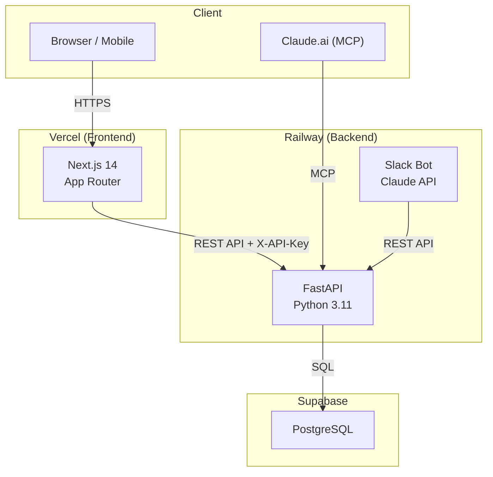

# habit-tracker

[](https://github.com/Ryosuke-Ha/habit-tracker/actions/workflows/backend-ci.yml)
[](https://github.com/Ryosuke-Ha/habit-tracker/actions/workflows/frontend-ci.yml)
[](https://habit-tracker-two-peach.vercel.app)

A personal habit management web app based on Atomic Habits principles.
Features AI coaching, weekly/monthly retrospectives, Slack notifications, and MCP integration.

**Demo:** https://habit-tracker-two-peach.vercel.app

---

## Features

### Habit Management
- Daily habit TODO management with day-of-week templates (weekday / weekend)
- Subtask management (inline editing, drag & drop reordering)
- Persistent TODOs (displayed daily until completed)
- Scheduled memos (date-specific tasks with Slack notifications)

### Retrospectives
- Weekly retrospective (KPT format, AI analysis, last week's Try display)
- Monthly retrospective (achievement rate chart, AI analysis, reflective questions)

### AI Coaching
- Cognitive science-based coaching (3-turn structure, insight-driven questions)
- Previous session commitments carried over to the next week
- Automatic transition to coaching after weekly retrospective

### Notifications & Integrations
- Slack notifications (scheduled memo reminders via GitHub Actions)
- MCP integration (operate TODOs and check retrospectives from Claude.ai)

---

## Tech Stack

| Category | Technology |
|---|---|
| Frontend | Next.js 14 (TypeScript, App Router) + Tailwind CSS |
| Backend | FastAPI (Python 3.11) + SQLAlchemy + Alembic |
| Database | PostgreSQL (Supabase) |
| Auth | NextAuth.js (Google OAuth) |
| Infrastructure | Vercel (Frontend) + Railway (Backend) |
| AI | Anthropic Claude API (Sonnet: coaching / Haiku: analysis) |
| Notifications | Slack Bot |
| MCP | habit-tracker-mcp (separate repository) |

---

## Architecture

```
User
  ├── Web UI (Next.js / Vercel)
  ├── Slack Bot
  └── Claude.ai (via MCP)
        ↓
  FastAPI (Railway) — Business Logic
        ↓
  PostgreSQL (Supabase)
```


```mermaid
graph TB
    subgraph Client
        Browser["Browser / Mobile"]
        ClaudeAI["Claude.ai (MCP)"]
    end

    subgraph Vercel["Vercel (Frontend)"]
        Next["Next.js 14\nApp Router"]
    end

    subgraph Railway["Railway (Backend)"]
        FastAPI["FastAPI\nPython 3.11"]
        SlackBot["Slack Bot\nClaude API"]
    end

    subgraph Supabase
        PG["PostgreSQL"]
    end

    Browser -->|HTTPS| Next
    Next -->|REST API + X-API-Key| FastAPI
    ClaudeAI -->|MCP| FastAPI
    SlackBot -->|REST API| FastAPI
    FastAPI -->|SQL| PG
```

### Design Principles

- **Business logic in the API layer** — Both the UI and AI call the same API endpoints; the database stores data only.
- **DDD patterns** — Value objects, Repository pattern, Rich Domain Model, Domain Services.
- **AI Context Engineering** — Pass only pre-processed, aggregated data to the AI using structured XML tags; never raw database records.

---

## Getting Started

### Prerequisites

- Node.js 20+
- Python 3.11+
- Supabase account
- Anthropic API key
- Google OAuth credentials

### Environment Variables

#### Frontend (`frontend/.env.local`)

```env
NEXTAUTH_URL=http://localhost:3000
NEXTAUTH_SECRET=your-secret
GOOGLE_CLIENT_ID=your-google-client-id
GOOGLE_CLIENT_SECRET=your-google-client-secret
NEXT_PUBLIC_API_URL=http://localhost:8000
NEXT_PUBLIC_API_KEY=your-api-key
```

#### Backend (`backend/.env`)

```env
DATABASE_URL=postgresql://...
ANTHROPIC_API_KEY=your-anthropic-api-key
FRONTEND_URL=http://localhost:3000
API_SECRET_KEY=your-api-secret-key
SLACK_BOT_TOKEN=your-slack-bot-token
SLACK_NOTIFY_CHANNEL=your-channel-id
INTERNAL_API_KEY=your-internal-key
```

### Installation

#### Backend

```bash
cd backend
python -m venv venv
source venv/bin/activate  # Windows: venv\Scripts\activate
pip install -r requirements.txt
alembic upgrade head
uvicorn main:app --reload
```

#### Frontend

```bash
cd frontend
npm install
npm run dev
```

Open http://localhost:3000 in your browser.

---

## Development Workflow

```
Create feature branch → Implement → Push
  ↓ Automatic
PR auto-created (auto-pr.yml)
  ↓ Automatic
CI runs (Backend CI · Frontend CI · AI Code Review)
  ↓ Manual
Merge to main
  ↓ Automatic
Deploy to Vercel & Railway + Branch auto-deleted
```

### Branch Naming Convention

| Type | Pattern |
|---|---|
| New feature | `feature/issue-{number}-{description}` |
| Bug fix | `fix/issue-{number}-{description}` |
| Refactoring | `refactor/issue-{number}-{description}` |

---

## MCP Integration

Use [habit-tracker-mcp](https://github.com/Ryosuke-Ha/habit-tracker-mcp) to operate from Claude.ai.

### Available Tools

| Tool | Description |
|---|---|
| `get_today_todos` | Get today's TODO list |
| `add_todo` | Add a TODO for today |
| `complete_todo` | Mark a TODO as complete |
| `add_scheduled_todo` | Add a scheduled memo |
| `get_persistent_todos` | Get persistent TODO list |
| `add_persistent_todo` | Add a persistent TODO |
| `get_weekly_summary` | Get this week's retrospective data |
| `add_kpt_item` | Add a KPT item |
| `get_monthly_stats` | Get this month's achievement rate and streak |
| `get_coaching_session` | Get this week's coaching session |
| `start_coaching` | Start a new coaching session |

---

## Slack Notification Setup

To enable Slack notifications for scheduled memos:

1. Create a `#habit-tracker-notify` channel in Slack.
2. Invite the bot to the channel:
   ```
   /invite @habit-tracker-bot
   ```
3. Get the channel ID (right-click the channel → Copy link → the `C0XXXXXXXXX` portion at the end of the URL).
4. Set the following environment variables in `backend/.env` and Railway:
   ```env
   SLACK_BOT_TOKEN=xoxb-...
   SLACK_NOTIFY_CHANNEL=C0XXXXXXXXX
   INTERNAL_API_KEY=your-secret-key
   ```
5. Add the following GitHub Actions secrets:
   - `BACKEND_URL` — your backend URL (e.g. `https://your-app.railway.app`)
   - `INTERNAL_API_KEY` — same value as above

---

## GitHub Actions Secrets

| Secret | Required by | Description |
|---|---|---|
| `ANTHROPIC_API_KEY` | `docs-update.yml` | Anthropic API key for the auto-documentation workflow |
| `BACKEND_URL` | `notification-check.yml` | Backend URL (e.g. `https://your-app.railway.app`) |
| `INTERNAL_API_KEY` | `notification-check.yml` | Shared secret for internal API endpoints |

> `GITHUB_TOKEN` is provided automatically by GitHub Actions and does not need to be added manually.

---

## Security

- API key authentication (`X-API-Key` header on all endpoints)
- Per-user daily rate limiting for Claude API calls
- Prompt injection protection (XML escaping of user content, template placeholder neutralization)
- Input validation via Pydantic (`Field` constraints on all user-provided strings)
- CORS restricted to the configured frontend origin

---

## License

Private
