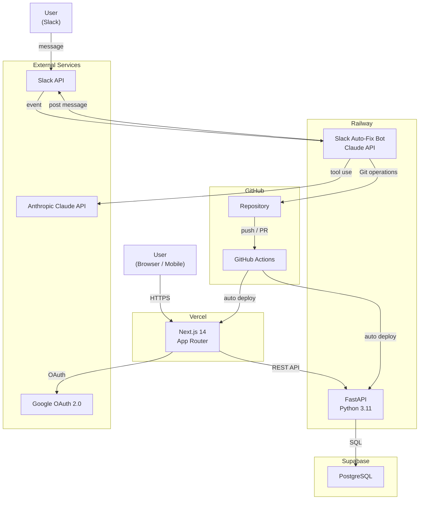
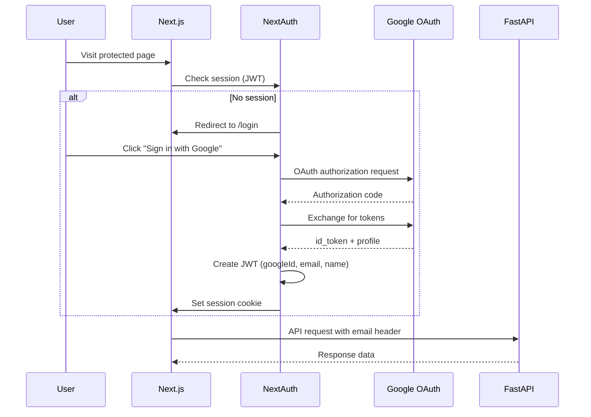
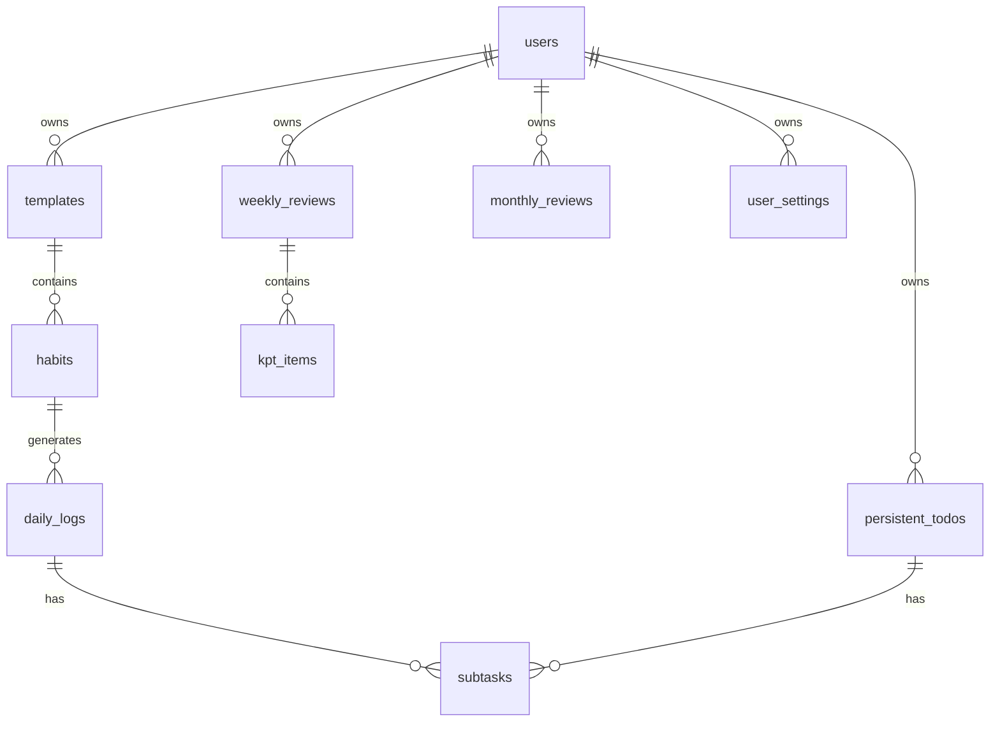
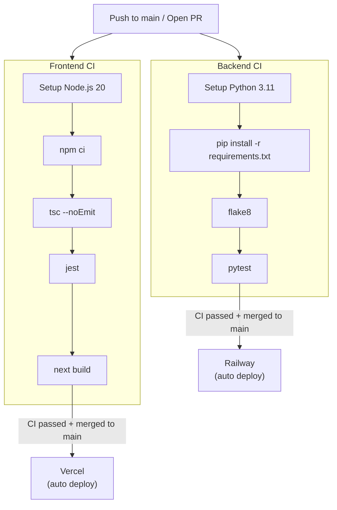
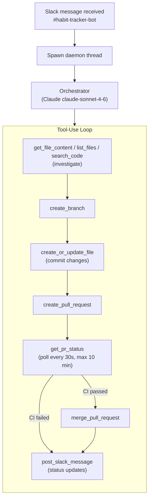

# Architecture

## 1. Overview

habit-tracker is a full-stack web application for daily habit management, built on the philosophy of Atomic Habits. The frontend is a Next.js 14 App Router app deployed on Vercel; the backend is a FastAPI service deployed on Railway, backed by a PostgreSQL database hosted on Supabase. A Claude-powered Slack bot completes the system, enabling AI-assisted code fixes that flow through GitHub Actions CI and auto-deploy to production.

**Key design decisions:**

- **Separate frontend/backend deployments** — Vercel handles the Next.js frontend with edge CDN; Railway hosts the Python backend and Slack bot independently, keeping concerns cleanly separated.
- **JWT-based sessions** — NextAuth.js issues client-side JWTs (30-day max age) for stateless auth; the backend trusts the Google-issued user email to scope all data access.
- **Hybrid settings storage** — User settings fall back to `localStorage` when logged out, then migrate to the database on first login, so the app works offline without a dedicated sync service.
- **Autonomous CI/CD bot** — The Slack bot uses Claude's tool-use loop to investigate, fix, PR, and merge code changes end-to-end with no human approval step required.

---

## 2. System Architecture



---

## 3. Frontend Architecture

### App Router Structure

```
frontend/
├── app/
│   ├── layout.tsx              # Root layout (AuthProvider, global styles)
│   ├── page.tsx                # Daily TODO dashboard
│   ├── login/page.tsx          # Login screen
│   ├── habits/page.tsx         # Habit list view
│   ├── templates/page.tsx      # Template management
│   ├── review/
│   │   ├── weekly/page.tsx     # Weekly KPT review
│   │   └── monthly/page.tsx    # Monthly review with charts
│   └── api/auth/[...nextauth]/
│       ├── authOptions.ts      # NextAuth configuration
│       └── route.ts            # NextAuth route handler
├── components/
│   ├── AuthProvider.tsx        # Session provider wrapper
│   ├── HabitList.tsx           # Habit list with drag-and-drop order
│   ├── HabitItem.tsx           # Individual habit row
│   ├── TodoItem.tsx            # Daily TODO row with subtask toggle
│   ├── TemplateSelector.tsx    # Template picker logic
│   ├── TemplateSelectorModal.tsx # Template picker UI
│   ├── AddHabitForm.tsx        # Form for adding new habits
│   ├── HamburgerMenu.tsx       # Navigation menu
│   └── LoadingOverlay.tsx      # Full-screen loading state
└── hooks/
    └── useSetting.ts           # Hybrid DB/localStorage settings hook
```

### Authentication Flow



### API Communication Pattern

All backend requests are made directly from client components using `fetch`. The user's email (from the NextAuth session) is attached as an `X-User-Email` header to identify the caller server-side. There is no dedicated API client library — calls are colocated with the components that need them.

---

## 4. Backend Architecture

### Project Structure

```
backend/
├── main.py          # FastAPI app, CORS config, router registration
├── models.py        # SQLAlchemy ORM models
├── database.py      # Engine, SessionLocal, get_db dependency
├── routers/
│   ├── templates.py         # Template CRUD
│   ├── habits.py            # Habit CRUD + daily log toggling
│   ├── persistent_todos.py  # Persistent TODO CRUD
│   ├── subtasks.py          # Subtask management
│   ├── reviews.py           # Weekly KPT reviews
│   ├── monthly_reviews.py   # Monthly reviews + stats
│   └── settings.py          # Key-value user settings
└── alembic/
    ├── env.py
    └── versions/            # Migration scripts
```

### Router Organization

Each router is mounted with a `/api` prefix in `main.py`. All endpoints identify the requesting user via the `X-User-Email` header — the backend performs an upsert on the `users` table so unknown emails are automatically registered on first request.

| Router | Prefix | Responsibility |
|--------|--------|----------------|
| `templates` | `/api/templates` | Manage habit templates (weekday/weekend) |
| `habits` | `/api/habits` | Habit CRUD, daily log generation and toggling |
| `persistent_todos` | `/api/persistent-todos` | Carry-over tasks across days |
| `subtasks` | `/api/subtasks` | Sub-items for habits and persistent todos |
| `reviews` | `/api/reviews` | Weekly KPT review CRUD |
| `monthly_reviews` | `/api/monthly-reviews` | Monthly review + achievement stats |
| `settings` | `/api/settings` | User preference key-value store |

### Database Access Pattern

All routes use FastAPI's dependency injection to obtain a SQLAlchemy `Session`:

```python
@router.get("/")
def get_items(db: Session = Depends(get_db), user_email: str = Header(...)):
    user = get_or_create_user(db, user_email)
    return db.query(Item).filter(Item.user_id == user.id).all()
```

`get_db` yields a session and ensures it is closed after the request, whether or not an exception occurs.

### Authentication Middleware

There is no JWT verification on the backend. The `X-User-Email` header is trusted because all traffic is expected to originate from the Next.js frontend (which validates sessions via NextAuth). In production, CORS is restricted to `FRONTEND_URL`.

---

## 5. Database Design

### Tables

| Table | Description |
|-------|-------------|
| `users` | Registered users (email, name, avatar_url) |
| `templates` | Habit templates owned by a user |
| `habits` | Individual habits belonging to a template (title, scheduled_time, location, order) |
| `daily_logs` | Per-day check records for habits; `habit_id` is nullable to support standalone log entries |
| `persistent_todos` | Carry-over tasks that repeat until `is_completed = true` |
| `subtasks` | Sub-items for either `daily_logs` or `persistent_todos` (polymorphic via `todo_type` + `todo_id`) |
| `weekly_reviews` | One record per user per week (keyed by `week_start_date`) |
| `kpt_items` | Keep / Problem / Try entries linked to a `weekly_review` |
| `monthly_reviews` | One record per user per month (keyed by `year_month` in `YYYY-MM` format) |
| `user_settings` | Key-value store for user preferences (e.g. selected template IDs) |

### Key Relationships



### Migration Strategy

Database schema is managed with **Alembic**. Migrations live in `backend/alembic/versions/` and are applied with:

```bash
alembic upgrade head   # apply all pending migrations
alembic downgrade -1   # roll back one migration
```

In development, `DATABASE_URL` points to a local SQLite file. In production, it points to the Supabase Transaction Pooler URI (PostgreSQL). The SQLAlchemy engine handles both dialects transparently.

---

## 6. CI/CD Pipeline



Vercel deploys automatically on every push to `main` via its GitHub integration. Railway detects changes through its own GitHub integration and redeploys both the backend and Slack bot services independently.

---

## 7. Slack Auto-Fix Bot Architecture

The bot is an autonomous agent powered by Claude's tool-use API. On receiving a Slack message it enters a multi-turn loop — calling tools to investigate the codebase, make changes, open a PR, and merge it — posting status updates back to Slack throughout.

### Component Layout

```
slack-bot/
├── main.py                  # Entry point — starts the Slack Bolt app
├── config.py                # Env var loading
├── github_client.py         # PyGitHub wrapper helpers
├── bot/
│   ├── slack_handler.py     # Slack event listener (spawns daemon thread)
│   └── approval.py          # (reserved for future approval flows)
└── agent/
    ├── orchestrator.py      # Claude tool-use loop + CI polling
    └── tools.py             # Tool schemas and implementations (9 tools)
```

### Agent Flow



### Available Tools

| Tool | Description |
|------|-------------|
| `get_file_content` | Fetch a file from GitHub by path |
| `list_files` | List directory contents in the repository |
| `search_code` | Full-text code search across the repository |
| `create_branch` | Create a new feature/fix branch |
| `create_or_update_file` | Write a file and commit it to a branch |
| `create_pull_request` | Open a PR with title and description |
| `get_pr_status` | Poll the latest CI check status for a PR |
| `merge_pull_request` | Squash-merge a PR after CI passes |
| `post_slack_message` | Post a progress update to the Slack channel |

---

## 8. Security

### Authentication Strategy

- Users authenticate via **Google OAuth 2.0** through NextAuth.js.
- Sessions are stored as **signed JWTs** in `httpOnly` cookies (30-day expiry).
- The backend does **not** verify JWTs — it trusts the `X-User-Email` header, which is safe because CORS is locked to the frontend origin in production.

### Environment Variable Management

- Secrets are stored in `.env` / `.env.local` files that are git-ignored.
- `.env.example` files document every required variable without values.
- Production secrets are injected at build/deploy time via Vercel and Railway environment variable settings.
- The Slack bot's `ANTHROPIC_API_KEY` and `GITHUB_TOKEN` are scoped to Railway only and never exposed to the frontend.

### API Authorization

- Every backend endpoint extracts the user from `X-User-Email` and queries only rows owned by that user (filtered by `user_id`).
- There are no admin-only endpoints; all routes operate on the authenticated user's own data.
- CORS is restricted to `FRONTEND_URL` (configured via environment variable) to prevent cross-origin abuse.

---

## 9. Future Considerations

### Mobile App (React Native)
The REST API is already mobile-friendly. A React Native client could reuse the same API endpoints with token-based auth — the main work would be replicating the hybrid `useSetting` storage logic using `AsyncStorage`.

### Apple Watch Support
A WatchOS companion app could surface the daily TODO list and allow simple check-off interactions. The backend would need a lightweight summary endpoint returning only today's incomplete items.

### Multi-Repository Support for Slack Bot
The bot currently hardcodes `GITHUB_REPO`. Supporting multiple repositories would require a repo-routing layer — either parsing the target repo from the Slack message or maintaining a channel-to-repo mapping in config — along with per-repo `GITHUB_TOKEN` credentials.
