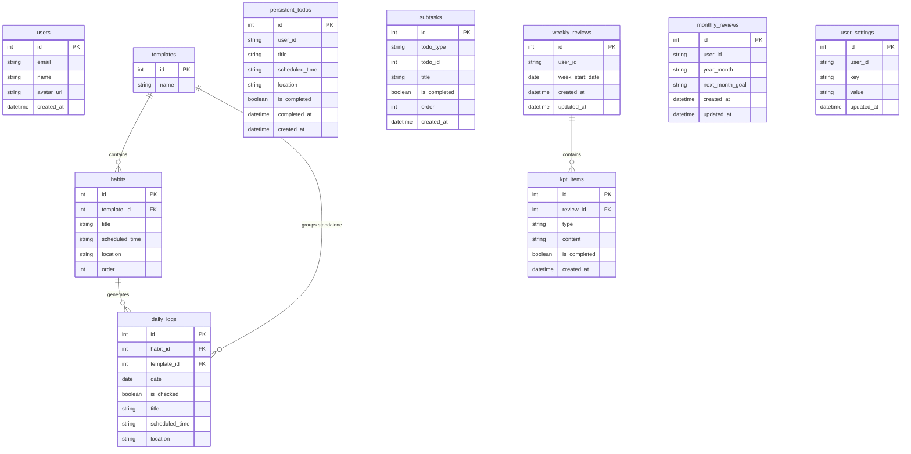

# Database Design

## 1. Overview

- **Database:** PostgreSQL, hosted on [Supabase](https://supabase.com)
- **ORM:** SQLAlchemy 2.0 (declarative style)
- **Migration tool:** Alembic 1.13

The schema is organized around a central user concept, identified by email rather than a surrogate integer key. Templates group reusable habits; daily logs are generated on demand when the user loads each day's TODO list. Persistent todos and subtasks handle carry-over work. Weekly and monthly review tables store KPT-format reflections and goal data independently of the habit tracking tables.

> **Local development** uses SQLite (`sqlite:///./habit_tracker.db`). The SQLAlchemy engine and Alembic migrations support both dialects transparently.

---

## 2. ER Diagram



> **Note on user references:** `persistent_todos`, `weekly_reviews`, `monthly_reviews`, and `user_settings` store the user's **email address** in their `user_id` column rather than a foreign key to `users.id`. This makes the schema robust to future auth changes and avoids join overhead for the most common query pattern.

---

## 3. Table Definitions

### `users`

Stores authenticated user profiles. Created automatically on first API request via Google OAuth.

| Column | Type | Constraints | Description |
|--------|------|-------------|-------------|
| `id` | INTEGER | PK, NOT NULL | Auto-increment surrogate key |
| `email` | VARCHAR | NOT NULL, UNIQUE | Google account email — used as the cross-table user identifier |
| `name` | VARCHAR | nullable | Display name from Google profile |
| `avatar_url` | VARCHAR | nullable | Profile picture URL from Google |
| `created_at` | DATETIME | default `utcnow` | Record creation timestamp (UTC) |

**Indexes:** `ix_users_id`, `ix_users_email` (UNIQUE)

**Relationships:** Referenced indirectly by other tables via `email` value.

---

### `templates`

Named groups of habits (e.g. "Weekday", "Weekend"). Templates are global — not scoped to a user in the current MVP.

| Column | Type | Constraints | Description |
|--------|------|-------------|-------------|
| `id` | INTEGER | PK, NOT NULL | Auto-increment surrogate key |
| `name` | VARCHAR | NOT NULL, UNIQUE | Template name — must be unique across the table |

**Indexes:** `ix_templates_id`

**Relationships:**
- `habits` (one-to-many, cascade delete)
- `daily_logs` (one-to-many via `template_id` — for standalone log filtering)

---

### `habits`

Individual habit entries belonging to a template. Ordered within the template by `order` and displayed sorted by `scheduled_time`.

| Column | Type | Constraints | Description |
|--------|------|-------------|-------------|
| `id` | INTEGER | PK, NOT NULL | Auto-increment surrogate key |
| `template_id` | INTEGER | FK `templates.id`, NOT NULL | Owning template |
| `title` | VARCHAR | NOT NULL | Habit name (e.g. "Morning Run") |
| `scheduled_time` | VARCHAR | NOT NULL | Time in `HH:MM` format |
| `location` | VARCHAR | NOT NULL, default `""` | Optional location hint |
| `order` | INTEGER | default `0` | Display order within the template |

**Indexes:** `ix_habits_id`

**Relationships:**
- Belongs to `templates`
- Has many `daily_logs` (no cascade delete — logs are detached, not destroyed, when a habit is deleted)

---

### `daily_logs`

One record per habit per day. Created lazily when the user loads the daily TODO screen. Also supports standalone (one-off) log entries that are not linked to any habit.

| Column | Type | Constraints | Description |
|--------|------|-------------|-------------|
| `id` | INTEGER | PK, NOT NULL | Auto-increment surrogate key |
| `habit_id` | INTEGER | FK `habits.id`, nullable | Link to the source habit. `NULL` for standalone entries |
| `template_id` | INTEGER | FK `templates.id`, nullable | Template association for standalone entries (used for daily filtering) |
| `date` | DATE | NOT NULL | The calendar date this log belongs to |
| `is_checked` | BOOLEAN | default `false` | Whether the habit was completed that day |
| `title` | VARCHAR | nullable | Copied from the habit on detach; also used as the title for standalone logs |
| `scheduled_time` | VARCHAR | nullable | Copied from the habit on detach; also used for standalone logs (`HH:MM`) |
| `location` | VARCHAR | nullable | Copied from the habit on detach; also used for standalone logs |

**Indexes:** `ix_daily_logs_id`

**Relationships:**
- Belongs to `habits` (nullable — standalone logs have no habit)
- Belongs to `templates` (nullable — for standalone log template scoping)

> **Detach on habit delete:** When a habit is deleted, its linked `daily_logs` are not deleted. Instead, `habit_id` is set to `NULL` and `title`/`scheduled_time`/`location` are copied from the habit so historical data is preserved.

---

### `persistent_todos`

Tasks that repeat every day until explicitly marked complete. Owned by a user (identified by email).

| Column | Type | Constraints | Description |
|--------|------|-------------|-------------|
| `id` | INTEGER | PK, NOT NULL | Auto-increment surrogate key |
| `user_id` | VARCHAR | NOT NULL, indexed | Owner's email address |
| `title` | VARCHAR | NOT NULL | Task description |
| `scheduled_time` | VARCHAR | nullable | Optional time hint (`HH:MM`) |
| `location` | VARCHAR | nullable, default `""` | Optional location hint |
| `is_completed` | BOOLEAN | default `false` | Completion state |
| `completed_at` | DATETIME | nullable | UTC timestamp set when `is_completed` becomes `true` |
| `created_at` | DATETIME | default `utcnow` | Record creation timestamp (UTC) |

**Indexes:** `ix_persistent_todos_id`, `ix_persistent_todos_user_id`

**Relationships:** Has many `subtasks` (polymorphic via `todo_type = "persistent_todo"`)

---

### `subtasks`

Sub-items for either a `daily_log` or a `persistent_todo`. Uses a polymorphic pattern — no SQL foreign key is defined; the parent is identified by `todo_type` + `todo_id`.

| Column | Type | Constraints | Description |
|--------|------|-------------|-------------|
| `id` | INTEGER | PK, NOT NULL | Auto-increment surrogate key |
| `todo_type` | VARCHAR | NOT NULL | Parent type: `"habit_log"` or `"persistent_todo"` |
| `todo_id` | INTEGER | NOT NULL, indexed | ID of the parent `daily_log` or `persistent_todo` |
| `title` | VARCHAR | NOT NULL | Subtask description |
| `is_completed` | BOOLEAN | default `false` | Completion state |
| `order` | INTEGER | default `0` | Display order within the parent |
| `created_at` | DATETIME | default `utcnow` | Record creation timestamp (UTC) |

**Indexes:** `ix_subtasks_id`, `ix_subtasks_todo_id`

**Relationships:** Polymorphic child of `daily_logs` or `persistent_todos`

---

### `weekly_reviews`

One review record per user per week. The week always starts on **Sunday**. Created automatically on first access for a given week.

| Column | Type | Constraints | Description |
|--------|------|-------------|-------------|
| `id` | INTEGER | PK, NOT NULL | Auto-increment surrogate key |
| `user_id` | VARCHAR | NOT NULL, indexed | Owner's email address |
| `week_start_date` | DATE | NOT NULL | The Sunday that opens this week |
| `created_at` | DATETIME | default `utcnow` | Record creation timestamp (UTC) |
| `updated_at` | DATETIME | default `utcnow`, `onupdate utcnow` | Last modification timestamp (UTC) |

**Indexes:** `ix_weekly_reviews_id`, `ix_weekly_reviews_user_id`

**Relationships:** Has many `kpt_items` (cascade delete)

---

### `kpt_items`

Individual Keep / Problem / Try entries belonging to a weekly review.

| Column | Type | Constraints | Description |
|--------|------|-------------|-------------|
| `id` | INTEGER | PK, NOT NULL | Auto-increment surrogate key |
| `review_id` | INTEGER | FK `weekly_reviews.id`, NOT NULL | Owning weekly review |
| `type` | VARCHAR | NOT NULL | One of `"keep"`, `"problem"`, `"try"` |
| `content` | VARCHAR | NOT NULL | The KPT item text |
| `is_completed` | BOOLEAN | default `false` | Used to track "Try" items carried over to the next week |
| `created_at` | DATETIME | default `utcnow` | Record creation timestamp (UTC) |

**Indexes:** `ix_kpt_items_id`

**Relationships:** Belongs to `weekly_reviews`

---

### `monthly_reviews`

One review record per user per month. Keyed by `year_month` string. Created automatically on first access for a given month.

| Column | Type | Constraints | Description |
|--------|------|-------------|-------------|
| `id` | INTEGER | PK, NOT NULL | Auto-increment surrogate key |
| `user_id` | VARCHAR | NOT NULL, indexed | Owner's email address |
| `year_month` | VARCHAR | NOT NULL | Month in `YYYY-MM` format (e.g. `2026-03`) |
| `next_month_goal` | VARCHAR | nullable, default `""` | Goal set for the following month |
| `created_at` | DATETIME | default `utcnow` | Record creation timestamp (UTC) |
| `updated_at` | DATETIME | default `utcnow`, `onupdate utcnow` | Last modification timestamp (UTC) |

**Indexes:** `ix_monthly_reviews_id`, `ix_monthly_reviews_user_id`

> `next_month_goal` is written in the **current** month's review but read as the **next** month's active goal. The `GET /reviews/monthly/current/goal` endpoint fetches last month's record to surface this goal on the daily screen.

---

### `user_settings`

Key-value store for per-user preferences (e.g. which template IDs to use for weekdays vs. weekends). Values are always strings; the frontend is responsible for parsing them.

| Column | Type | Constraints | Description |
|--------|------|-------------|-------------|
| `id` | INTEGER | PK, NOT NULL | Auto-increment surrogate key |
| `user_id` | VARCHAR | NOT NULL, indexed | Owner's email address |
| `key` | VARCHAR | NOT NULL | Setting name (e.g. `weekday_template_id`) |
| `value` | VARCHAR | nullable | Setting value as a string |
| `updated_at` | DATETIME | default `utcnow`, `onupdate utcnow` | Last modification timestamp (UTC) |

**Indexes:** `ix_user_settings_user_id`

**Common keys**

| Key | Example Value | Description |
|-----|---------------|-------------|
| `weekday_template_id` | `"1"` | Template ID used on Monday–Friday |
| `weekend_template_id` | `"2"` | Template ID used on Saturday–Sunday |

---

## 4. Key Relationships

### User → Templates (indirect)
Templates are **global** in the current MVP — they are not scoped to a specific user. Users select which templates apply to their weekdays and weekends via `user_settings`.

### Template → Habits (one-to-many, cascade delete)
Each template contains an ordered list of habits. Deleting a template cascades to its habits via SQLAlchemy `cascade="all, delete-orphan"`.

### Habit → DailyLogs (one-to-many, detach on delete)
When the daily screen loads, one `daily_log` is created per habit per day (lazy creation). When a habit is deleted, existing logs are **detached** (not deleted): `habit_id` is set to `NULL` and the habit's display fields are copied into the log's standalone columns so historical check data is preserved.

### Template → DailyLogs (one-to-many, for standalone entries)
Standalone daily logs (not linked to any habit) use `template_id` for scoping, so the daily screen can filter them correctly by the active template.

### PersistentTodo / DailyLog → SubTasks (polymorphic one-to-many)
`subtasks` uses a `(todo_type, todo_id)` pair instead of multiple nullable foreign keys. There is no SQL-level referential integrity constraint — the application layer enforces validity. `todo_type` is either `"habit_log"` or `"persistent_todo"`.

### User → PersistentTodos (one-to-many)
Filtered by `user_id = user_email`. Ordered by `created_at` ascending.

### User → WeeklyReviews (one-to-many)
One review per user per week (unique on `(user_id, week_start_date)`). The API auto-creates a review record on first access for the current week.

### WeeklyReview → KPTItems (one-to-many, cascade delete)
KPT items are deleted when their parent review is deleted.

### User → MonthlyReviews (one-to-many)
One review per user per month (unique on `(user_id, year_month)`). Auto-created on first access.

### User → UserSettings (one-to-many)
Each `(user_id, key)` pair is effectively unique — the API performs an upsert when writing a setting.

---

## 5. Migration Guide

Migrations live in `backend/alembic/versions/`. Always run them from the `backend/` directory.

### Apply all pending migrations

```bash
cd backend
alembic upgrade head
```

### Roll back the most recent migration

```bash
alembic downgrade -1
```

### Roll back to a specific revision

```bash
alembic downgrade ec7ba1b3551b
```

### Check the current revision

```bash
alembic current
```

### View the full migration history

```bash
alembic history --verbose
```

### Create a new migration

After editing `models.py`, auto-generate a migration script:

```bash
alembic revision --autogenerate -m "describe your change here"
```

Review the generated file in `alembic/versions/` before applying it — autogenerate is not always perfect (e.g. it may miss server defaults or index names).

### Migration history

| Revision | Description | Date |
|----------|-------------|------|
| `ec7ba1b3551b` | Initial schema (all core tables) | 2026-03-18 |
| `a1b2c3d4e5f6` | Add standalone fields to `daily_logs` (`title`, `scheduled_time`, `location`, `template_id`; make `habit_id` nullable) | 2026-03-22 |
| `d6ab167250ae` | Add FK constraint from `daily_logs.template_id` → `templates.id` | 2026-03-22 |
| `e9f0a1b2c3d4` | Add `user_settings` table | 2026-03-22 |

---

## 6. Design Decisions

### PostgreSQL over SQLite for production

SQLite works well locally (zero configuration, file-based), but PostgreSQL is used in production because:

- **Concurrency:** PostgreSQL supports row-level locking and true concurrent writes, which SQLite cannot handle safely with multiple Railway dynos.
- **Supabase integration:** Supabase provides managed PostgreSQL with built-in connection pooling (PgBouncer), backups, and a web UI — reducing operational overhead to near zero.
- **Type fidelity:** PostgreSQL enforces column types strictly; SQLite is dynamically typed, which can mask bugs.

The SQLAlchemy engine is configured via `DATABASE_URL` so switching between SQLite (dev) and PostgreSQL (production) requires no code changes.

### SQLAlchemy + Alembic

- **SQLAlchemy** provides a Pythonic ORM that abstracts SQL dialects, making the codebase portable between SQLite and PostgreSQL without conditional logic.
- **Alembic** generates incremental, version-controlled migration scripts from model diffs. This gives a reproducible schema history and safe rollback capability, which bare `CREATE TABLE` scripts do not.

### Hard delete policy

All deletions are **hard deletes** — records are physically removed from the database. Soft deletes (adding an `is_deleted` flag) were considered but rejected:

- The application has no audit trail or undo requirement.
- Soft deletes add query complexity (every query must filter `WHERE is_deleted = false`).
- The **habit detach pattern** (copying fields into `daily_logs` when a habit is deleted) achieves the practical goal of preserving historical check data without a generic soft-delete system.

### Timezone handling

All `DATETIME` columns store **UTC timestamps** using Python's `datetime.utcnow()`. The frontend is responsible for converting to the user's local timezone for display. No timezone-aware column types are used — this keeps the schema simple and avoids dialect-specific timestamp type differences between SQLite and PostgreSQL.

Dates (`DATE` columns such as `daily_logs.date` and `weekly_reviews.week_start_date`) represent calendar dates with no time component and are always determined by the server's local date at request time.
